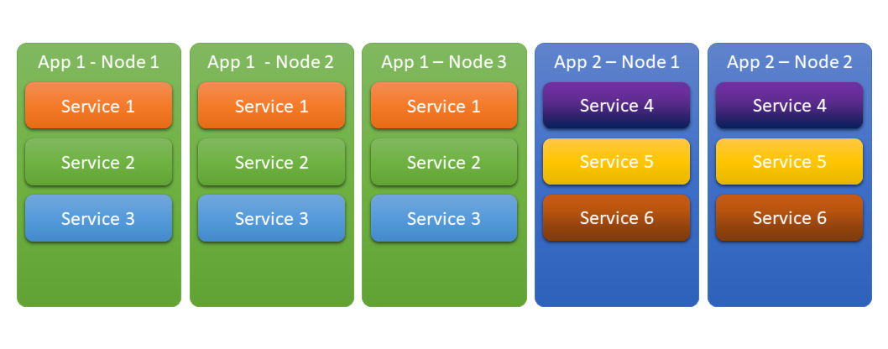
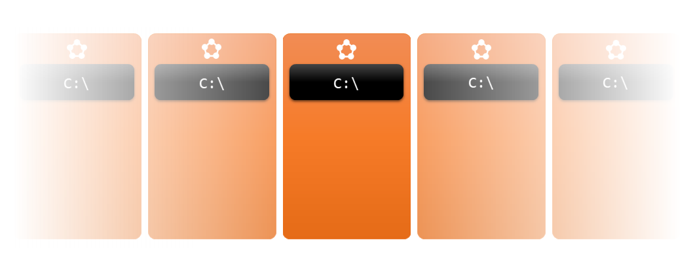
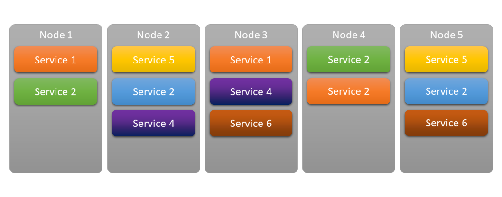

I’ve been studying Service Fabric for a while now in small steps and one thing I noticed about most of the introduction material is that they are usually following a “top-down” approach when introducing the features of Service Fabric instead of gradually building them up from the bottom.

So this blog series is going to be a slightly unusual attempt to introduce Service Fabric to developers with already existing experience of building – and more importantly – hosting web services. It’s going to start from the basics and gradually introduce many of Service Fabric’s capabilities in about 4 or 5 blog posts.

To start from the absolute basics, lets talk a little bit about the lifecycle of backend services.

# A Console App

In its rawest form a backend service can be thought of as a simple console app. You start it and it starts listening to some kind of input channel in an infinite loop until it’s asked to stop or it fails.

Running a console app is nice and simple, you can even set it up to start automatically on system startup, but if it unexpectedly fails, you’re left on your own. Something (or someone) will have to monitor this app and restart it if it stops.

# A Windows Service

This is where Windows Services can come in handy. They do exactly that. You can convert your app into a Windows Service and you will get nice lifecycle management like auto-start, auto-restart on failure and graceful shutdown.

It gives you resiliency for software failures, in a way even for transient hardware failures like a power outage because once the machine start back up, your service will start with it. As long as the server is running, your service will be running too. But if the machine goes down, nothing will save your service.

# The Traditional Way To Host Services 
## On-premises

In traditional, on-premises environments, if you have a small datacenter with 10 machines (SVR1-10) and you want to scale out your service to 5 of those machines (SVR1-5) for throughput and/or reliability purposes, you will specifically install your service to 5 of those machines (i.e. SVR1-5). It will give you a reasonably good resiliency for hardware failures, because even if a node (lets say SVR1) goes down, four other (SVR2-5) will still remain and will run your service, ideally with no noticeable disruption for your users. But, it worth mentioning that if it happens, it will be up to you to adapt to the situation and reconfigure your deployment for your service to deploy it to 5 of the remaining 9 nodes (SVR2-6) or to get a new server to replace the faulty one.

## In the Cloud

In the cloud things work differently. You don’t necessarily have access to a very specific set of machines, so you can no longer say you want a service to be deployed to SVR1 and SVR7. You just package up your application, or prepare a VM image and tell the cloud to spin up two machines (to follow the example) with them. If you want to scale your service, you start up new machines. If you want to host other services, they will have their own machines. If you feel like the one service per machine model is a bit too wasteful and you want to bundle services to be hosted on the same machine, you can do it, but they will scale together.

# The Modern Way To Host Services 
## Service Orchestrators

As you can see already based on some of the most basic examples, even without a single line of business logic, just keeping your services up and running can be quite challenging. This is where we are going to start talking about the so-called service orchestrators. Some of them you might have heard of are Docker (Swarm), Kubernetes, Mesos (Marathon) and of course Service Fabric. While Docker Swarm and Kubernetes are pure Container orchestrators, Mesos and Service Fabric are more generic solutions that happen to support Containers (amongst other type of workloads).

These systems will give you an abstraction over your cluster and help you with your service deployment, placement, monitoring, scaling, updates and more.

# A Service Fabric Service

To finish this post, I’d like to paint a picture of how Service Fabric services are different from Windows Services.

With Service Fabric you get an extra layer of management for your services. Service Fabric will run as a Windows Service an all machines and your services will be managed by Service Fabric (instead of Windows). Service Fabric will keep track of your cluster nodes and your service instances (across the whole cluster) in real-time and make sure you have all your services running on the cluster with the right number of instances.

While Windows Services will guarantee you a single instance of your service running on a given machine, Service Fabric will guarantee the requested number of instances of your services running across a (potentially dynamically changing) cluster of machines. As long as you don’t run out of physical hardware, Service Fabric will keep your services alive without any intervention.

---

# [What can Service Fabric do for you?](/draft-sf-what-service-fabric-can-do-for-you)

The next article, will introduce some of the “low hanging fruits”, features that can be used without actually integrating with Service Fabric, features that you basically get for free when you are running on top of Service Fabric.