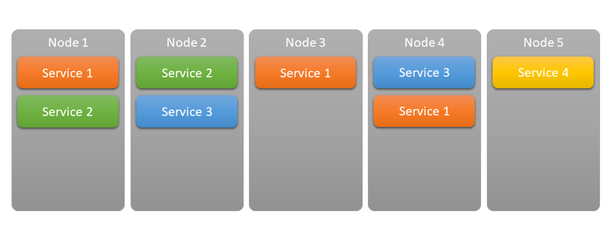
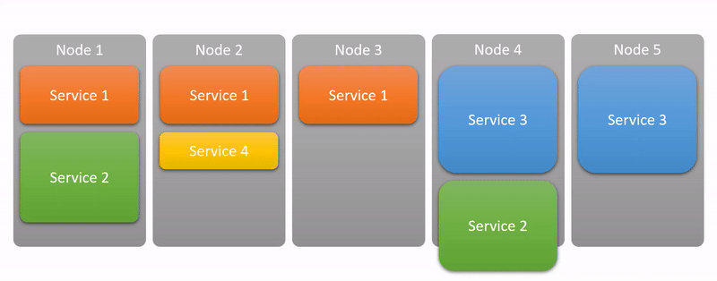
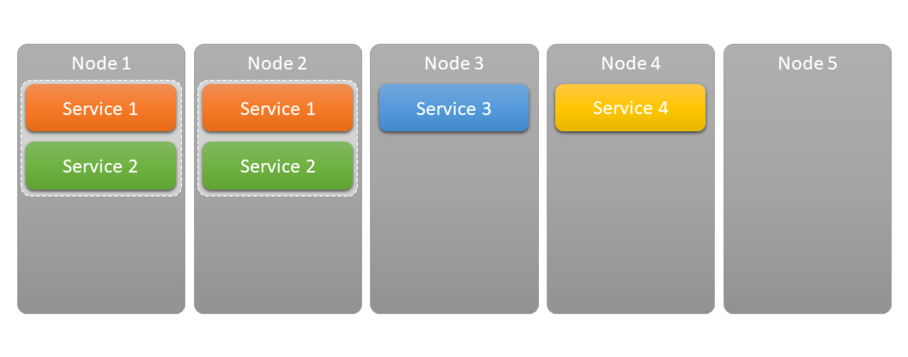
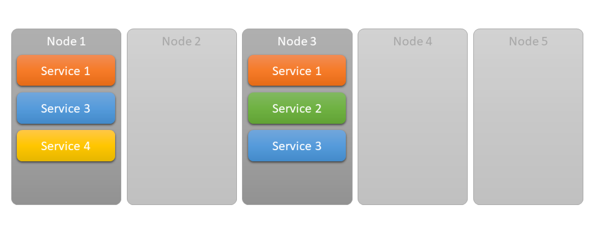
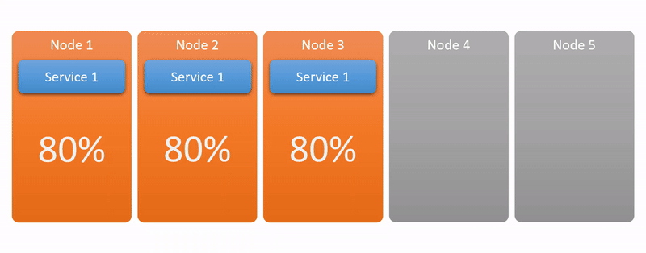
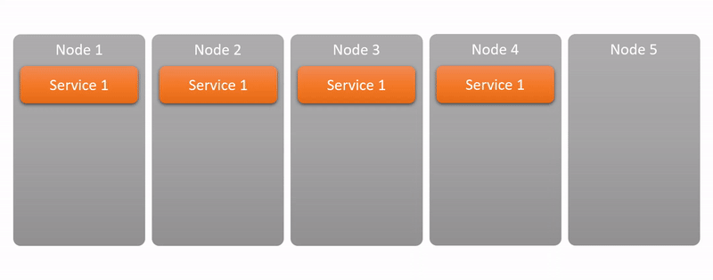
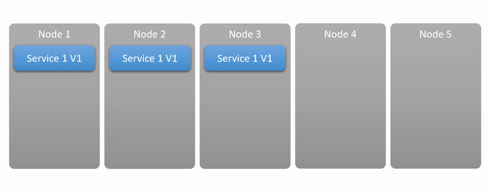

Service Fabric offers a wide range of tools to manage services and many of these can be used without touching an existing service, purely through manifest files. I believe walking through these is a good exercise because these are typically the kind of features people try to achieve for their own services, hosted on-premises or even in the cloud.

# Instance Count

Probably one of the most essential feature is the ability to specify the Instance Count. With typical webservices the (easy) way to achieve better throughput is to increase the number of services so they can serve more requests in parallel.

## Static – Application Manifest file

When you are working on on-premises solutions, it’s highly likely that the available hardware resources are fixed and so does your expectations for the possible load on your system, so you can just specify this number in-advance in the application’s manifest file and leave it with that. You know you have 10 machines, you know you need 5 instances of the service running and that’s all you want. Service Fabric will still provide useful lifecycle management, handling of possible node outages and ideally balancing all the services between the machines to achieve even load.

## Manual – Dashboard

In case you have a relatively small service with mostly constant load but suddenly you need an extra instance (or two, or three, or ten) you can always just go to the dashboard and manually change the instance count of the service.

## Automatic – Scaling Policies

A better way of dealing with scaling though is using scaling policies which can be defined as part of the service’s manifest file without any code change in the actual service, so it’s still basically free. By default it can be tied to CPU or memory. Service Fabric will keep track of these basic metrics (on a per service process basis) and make sure it spawns up enough service instances to deal with the load.

While in on-premises environments the number of machines is fixed, maybe there are different workloads for different parts of the day. Maybe during the day the system has to serve customer requests and by night it can crank up on some data analytics. Even with fixed hardware resources, scaling actually makes sense, you don’t have to stick to a static number of service instances.

## Programatic – FabricClient

In case you already have some kind of monitoring and scaling solution in place, you can probably use it to communicate with Service Fabric to handle the scaling (and placement) of services, instead of explicitly dealing with the deployment of services to specific cluster nodes. Service Fabric exposes a number of HTTP endpoints to control the cluster.

# Resource balancing

Service Fabric has a lot of smartness inside to try to even the resource usage of all services on all nodes. What it means is that even if from an external point of view the service runs perfectly fine and can handle all incoming requests, the internal load distribution of the actual nodes might be uneven, having lots of load on one node while leaving others with barely any work to do. Service Fabric will make sure to check these situations time-to-time and rebalance service instances to have a better balance across the cluster which means more space for the services on individual nodes to handle potential spikes in requests without hitting hardware limits.

By default, Service Fabric will just balance the services regardless of their actual physical resource consumption, just by simply making the number of service instances even across the cluster nodes.

You can define CPU and memory consumption triggers to be taken into consideration when Service Fabric check on the resource usage of services.

You can give Service Fabric indication about how expensive it is to move a given service, so it will try and move around lightweight services first when it’s trying to re-balance the cluster, instead of taking down expensive-to-move services that might have lots of in-memory state or takes long to start up.

You can also specify default expected load for a given service so when a new instance is being created (for example because of a scale-up operation) or an existing instance is being moved to another node, Service Fabric will take this into consideration to find the right node to place it.

# Service Affinity / App Groups

With all these magic happening under the hood, you might feel a little out-of-control of your service’s placement. You might want to link certain services together so that they are hosted together on the same machine, for example for performance reasons (chatty communication between services). While you can’t force services to always stick together, you do have a best-effort option to link them together and tell Service Fabric to try and place them together if it’s possible.

It’s also possible to limit the number of nodes an Application (a collection of Services) can span across. Basically even if you have a cluster of 50 servers, you can limit your services to a virtual mini cluster of 5 machines. You can’t point to 5 specific nodes, but Service Fabric will make sure that your app won’t take up more than 5 nodes and it will do all the resource juggling within the limit of those 5 nodes.

It’s worth mentioning though that those nodes won’t be exclusive to the application’s services, they can and probably will host other services as well.

# Auto Scaling

Similarly to how the Resource Balancing can pay attention to load metrics, it’s also possible to set up triggers for auto scaling. When setting up auto scaling you can define the lower/upper thresholds for certain metric(s), the minimum/maximum instance counts and scale steps.

# Self Healing

Service Fabric always monitors the services and makes sure they are running as expected on the cluster.

## Service Failure

When a service stops working for some reason, Service Fabric will immediately try to restart it. This restart procedure is not as simple as restarting the service wherever it was, it will take the opportunity to restart the service on the best node possible after some resource balancing.

## Node failure

In case a node falls out (or you just simply scale down your cluster), Service Fabric will make sure to re-arrange the services from that node on the remaining nodes of the cluster.

# Rolling Updates

Service Fabric is designed to provide the highest possible level of reliability and availability for your services. So the default behaviour of the update mechanism is rolling updates. It means it will update your services one by one to maintain availability even during updates. Using health monitoring, if during the update services start reporting unhealthy statuses, Service Fabric will stop the roll-out and roll back to the previous (working) version.

# Service Discovery + Load Balancing

In the world of Service Fabric you never directly address the individual nodes, you let Service Fabric handle it for you. What you really want is the ability to talk to services.

The placement of services are unpredictable, but of course Service Fabric keeps track of them, so in case you really-really want to directly talk to your service instances you can ask it to resolve a service name into one ore more addressable endpoint (IP address) with a pattern that looks something like this:

`fabric:/<AppName>/<ServiceName>`

In a realistic real-world scenario when you are hosting a webservice, what you really want is to call an HTTP endpoint and get your request served by one of the service instances (preferably the one with the least amount of load). This is load balancing and you get it for free for your services. Service Fabric will provide a single endpoint for your (logical) service and route the incoming requests to the most appropriate service instance behind the scene. While it might not sound a big deal for someone having experience with hosting webservices in the cloud, for devs in the on-premises world, where such load balancers are set up manually, it’s going to be a great relief.

# Run Anywhere & Host Anything

With Service Fabric you have the ultimate flexibility to host your services.

Your service can be pretty much anything:
 - Existing services as an ordinary executables or even as Docker Containers
 - Or native Service Fabric services that tightly integrate into the platform and get the most out of it – *you will hear much more about this option in the next articles*

You don’t only have the flexibility in what Service Fabric can run, but also where Service Fabric can run:  it’s is available for Windows and Linux and as a managed service offering on Azure.