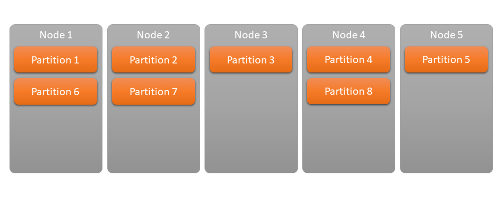

In this article I will introduce some of the more advanced use-cases of Service Fabric. Following the previous article, the main focus is still going to be resource/load balancing and scaling, but this time using some of the more advanced techniques that "don't come for free".

# Custom load metrics

In the previous article I briefly touched the area of Resource Balancing and Scaling but I was only focusing on the out-of-box functionality - balancing simply by the number of instances on each node and/or taking CPU and memory consumption into consideration.

If you want more refined metrics and better balancing, you can provide your own metrics and feed them to Service Fabric so it can take them into consideration when trying to decide which service to move around or scale. These can be absolutely anything, like number of requests per second, length of an internal queue or anything that comes into your mind that is a good metric to represent the load on your system.

When creating metrics your primary concern should be your service's responsiveness. Anything that can overload your system and slow it down is a potential problem and something that should be measured and reported so Service Fabric can do its best to balance and/or scale services to handle the load.

## CPU

High CPU load can easily cause high latency when serving requests if your service actually keeps hitting 100% CPU utilisation. It might even turn other parts of your application completely unresponsive and cause all kinds of timeout issues.

## Memory

High memory usage can be dangerous if the machine starts paging your memory and slows down because it has to read from the hard drive.

## Requests per second

High number of parallel requests can cause lock issues if your application logic is not 100% perfectly parallel. Even if it is, spawning more and more threads to serve the individual requests will cause lots of context switching and slow down your process.

## Network

You might want to monitor the network utilisation if your service has heavy traffic. It will add up from all services on a node and Service Fabric will try to balance things around to make sure you have the most available bandwidth for your services. If your service happens to be a streaming service, this would be a very important metric to keep an eye on.

## Queue length

If your service is a queue processor, you might want to monitor the length of the queue and scale your service if you see messages in the queue building up (not getting processed fast enough).

These are just a few examples to what you can pay attention to when measuring load metrics. Again, it's absolutely up to your imagination to decide what kind of numbers you want to come up with.

## Metric weight

Because services can have many different metrics, you need a way to consolidate them so Service Fabric can make a good decision when taking actions based on these numbers. Luckily, the metrics system is designed in a way that you can define the weight the metrics.

What it means is that you can say you are very worried about the CPU utilisation (give it a heavy weight) and less worried but still interested in a queue count (lighter weight). If the CPU starts hitting high percentages, you definitely want to either move your services around or add new instances... but even if the CPU is not melting in the machines but your queue count is growing, it means you are processing the messages too slow and should add new service instances.

## The source of metrics
Metrics can come from anywhere. You can report them directly from your services but if you already have a monitoring solution through some kind of daemon process, you can use its reports to feed into Service Fabric as well.

# Partitioning

With custom metrics and fine-tuned weights you did your best to balance and scale your services and get the most out of your hardware resources. But what if it's still not quite enough?

One typical problem webservice developers find themselves facing is that they have no control over which service instance serves which request. The load balancer is basically random. Requests concerning a given resource can (and will) be served from any of the service instances. A request to update a piece of information can hit one instance and a request to query it can hit another one. There's even a good chance your overall system will provide inconsistent information because of this. But there's not much we can do about it so it's generally accepted.

But what if it doesn't have to be like that?

The next step in your journey to optimize your services is the concept of partitioning. With partitioning, every services instance will have a key or key range that it can be addressed with. It means that requests addressing a specific key will always be handled by the same service instance. If you choose your partitioning key well, it can provide similar load balancing to a traditional "random" load balancer but with the benefit of being deterministic.
Why a deterministic load balancing is useful? For one example, because you can build hot caches on the service instances for just the partitions instead of replicating the whole cache on every single instance that can cause a serious memory pressure. If you know you only ever have to deal with a certain subset of your customers, you can build the cache just for them and stay within a reasonable memory consumption while providing super fast responses because everything can be served from memory. When every request to a given resource is handled by the same process, you also have much better control over potential race condition related issues.

But before moving on to introduce the options provided by Service Fabric, I'd like to pause for a moment and emphasize how important it is to come up with the right partitioning strategy. For example if you'd choose to partition your services by country, one service might have a couple of million customers inside while another would have hundreds of millions and the load on the two service instances handling the different partitions would be wildly different.

## Numeric Range Partitioning

When you are setting up your service to use numeric partitioning, you will have to define the  start and the end of the range and the number of partitions you want to split this range into.

To walk through a quick example, you might have Customer IDs between 1 and 1000 (so 1 is going to be the start of the range and 1000 the end) and you want to split the processing of these customers between 10 service instances. So the first service instance will be responsible for handling Customers with ID 1-100, the second instance for Customer IDs of 100-200 and so on.

Using this kind of partitioning can, in certain cases, be very simple and straightforward. When your partition key is just a hash (that usually has very nice and even distribution), you can just max out your available range (which is the limits of Int64 type) and let the magic happen for you, the only serious decision you have to make is to decide the number of partitions. Although that is a serious and relatively permanent decision. For obvious reasons you can't dynamically change the number of partitions while the service is running so if you didn't manage to catch a good number and you want to scale further, you will have to update the service in which step you can increase the number of partitions (or even modify the range).

When deciding on the number of partitions, the general advice is to shoot a little bit above your needs. While traditional "singleton partitioned" services can only have a single instance running on a given node, with partitioned services you might have multiple service instances (serving different partitions) running on the same node. You don't want to aim too low because your service might not be able to scale even if you add more nodes to the cluster, but you also don't want to aim too high because you will be just wasting resources with the overhead of hosting too many under-utilised services. If by any chance you can predict the maximum possible number of nodes your cluster will have in the near future, you should probably aim for that number.

To summarize, numeric partitioning can be a strong alternative to traditional "random" load balancing with the benefit of being deterministic. It's very easy to set up, but doesn't provide too much elasticity.

## Named Partitioning

Instead of numerical ranges, you might be able to divide your request by the name of the resource they interact with. For example you might be building the backend services of a multiplayer game. You will want to be able to address a specific "match" by name when you join a game.

The good thing about named partitions is that they can come and go, they can be added and removed on demand. As new games are starting, new partitions are created, and once they finish, they will be removed.

Compared to numeric partitioning, with named partitions you have to know exactly what kind of requests you want to serve and explicitly create (and later remove) the partitions for those cases. It needs a bit more work from an orchestration point of view, but gives more flexibility in terms of scaling.

---

# [Stateful Services](sf-stateful-services)

In the next article I will focus on a single major feature of Service Fabric, something I've been building the foundation for with these 2.5 articles. Stateful Services are the next step in the journey of integrating with Service Fabric and by leveraging its benefits, achieving even better performance and lower latency.