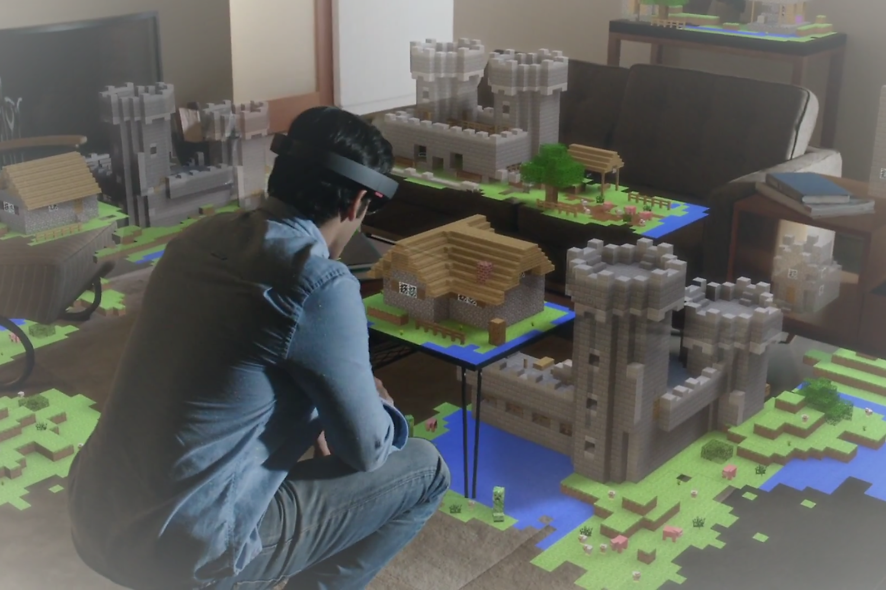

This content was written in Markdown then converted to HTML on the fly.

## Image to test URL rewrite and styling

That's all folks. I think pretty much this is all I need for a meaningful blog engine.
* Text
* Code
* Images